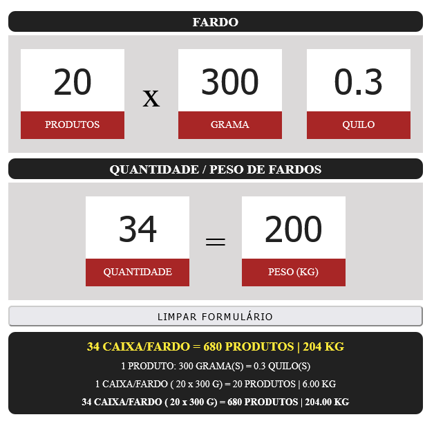
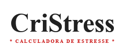

<h1 align="left">CriStress (Calculadora de Fardos)</h1>

Projeto desenvolvido com o intuito de auxiliar o pessoal do setor de compras, na empresa em que trabalho, na tarefa de converter peso em fardos, ou vice-versa. 

<h2>Tecnologias:</h2>

<ul>
    <li>HTML</li>
    <li>CSS</li>
    <li>JavaScript</li>
</ul>
<h1></h1>

O nome da calculadora é uma brincadeira com uma colega de trabalho que ficava muito estressada na hora de fazer esses cálculos...

<h1></h1>
#cristress

